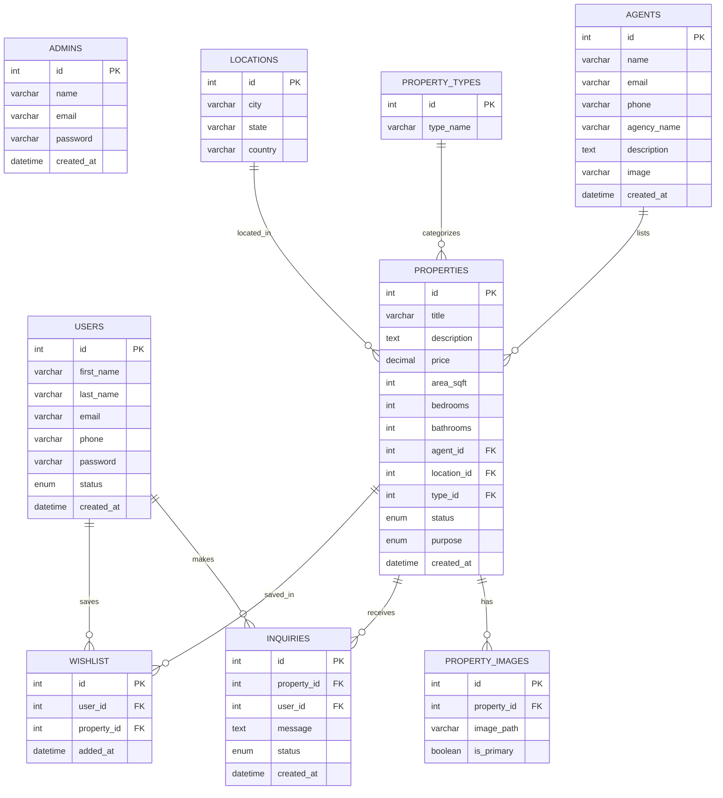

# Entity Relationship Diagram

```mermaid
erDiagram
    ADMINS {
        int id PK
        varchar name
        varchar email
        varchar password
        datetime created_at
    }
    
    USERS {
        int id PK
        varchar first_name
        varchar last_name
        varchar email
        varchar phone
        varchar password
        enum status
        datetime created_at
    }
    
    AGENTS {
        int id PK
        varchar name
        varchar email
        varchar phone
        varchar agency_name
        text description
        varchar image
        datetime created_at
    }
    
    LOCATIONS {
        int id PK
        varchar city
        varchar state
        varchar country
    }
    
    PROPERTY_TYPES {
        int id PK
        varchar type_name
    }
    
    PROPERTIES {
        int id PK
        varchar title
        text description
        decimal price
        int area_sqft
        int bedrooms
        int bathrooms
        int agent_id FK
        int location_id FK
        int type_id FK
        enum status
        enum purpose
        datetime created_at
    }
    
    PROPERTY_IMAGES {
        int id PK
        int property_id FK
        varchar image_path
        boolean is_primary
    }
    
    INQUIRIES {
        int id PK
        int property_id FK
        int user_id FK
        text message
        enum status
        datetime created_at
    }
    
    WISHLIST {
        int id PK
        int user_id FK
        int property_id FK
        datetime added_at
    }

    PROPERTIES ||--o{ PROPERTY_IMAGES : has
    PROPERTIES ||--o{ INQUIRIES : receives
    USERS ||--o{ INQUIRIES : makes
    USERS ||--o{ WISHLIST : saves
    PROPERTIES ||--o{ WISHLIST : saved_in
    AGENTS ||--o{ PROPERTIES : lists
    PROPERTY_TYPES ||--o{ PROPERTIES : categorizes
    LOCATIONS ||--o{ PROPERTIES : located_in
```
